## Техническое задание на разметку данных по расположению и отображению кнопок на саммых популярных сайтах

### Как размечать данные?
Для разметки данных необходимо скачать программу [Label.Me](https://www.notion.so/fa089cffa21a4ce59a113757c1f00725?pvs=21). 

Данные из архива необходимо разархивировать, открыть полученную папку со скриншотами в программе Label.Me.

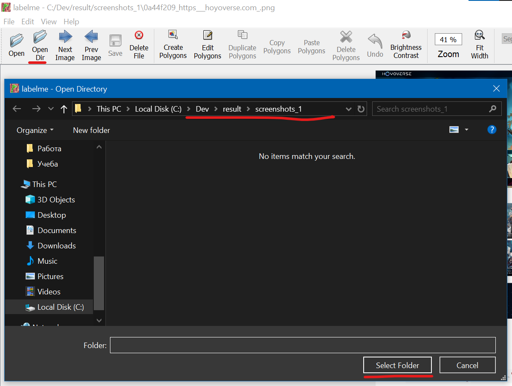

После открытия первого скриншота в программе нужно настроить добавление аннотации при помощи прямоугольников, для этого можно ввести комбинацию клавиш `CTRL + R` или выбрать специальный режим аннотации через `edit → create rectangle`.

Далее на скриншоте необходимо найти кнопку и обвести ее в прямоугольник, после чего программа выдаст промпт на выбор лейбла для конкретной аннотации, необходимо создать и выбрать лейбл button. Пример на скриншоте ниже. 

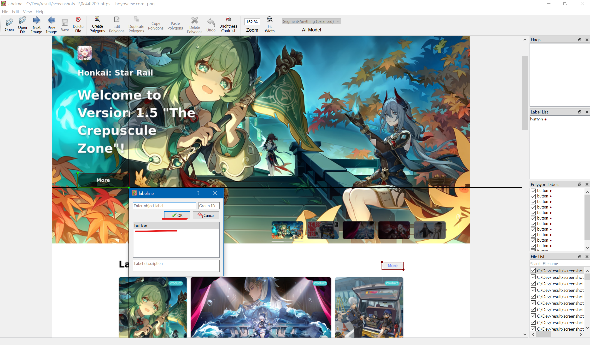

Для сохранения можно нажать комбинацию клавиш `CTRL + S` или выбрать в настройках опцию `file -> save automatically`.

Для выбора следующего изображения в папке можно воспользоваться кнопкой `Next Image`. Размечать кнопки нужно по границе, либо с небольшим зазором (не более 2-3px).

### Что размечать на скриншоте?

Мы учимся детектить простую кнопку в горизонтальном расположении. Нам нужно разметить визуальные элементы, которые выглядят как кнопки. Т.е. обладают видимой границей, по нажатию на которую должна произойти интеракция с приложением.

### Сравнительные примеры разметки

Ниже приведены примеры корректных и некорректных разметок кнопки в контексте данной задачи.

✅ Ниже приведет пример кнопок, разметка которых является корректной. 
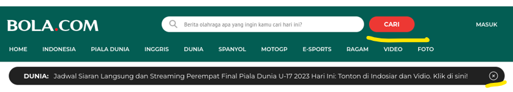

🚫 Ниже приведен пример кнопкок, разметка которых не требуется и не является верной в контексте данной задачи (по причине отсутсвия явных границ элемнта на странице). 
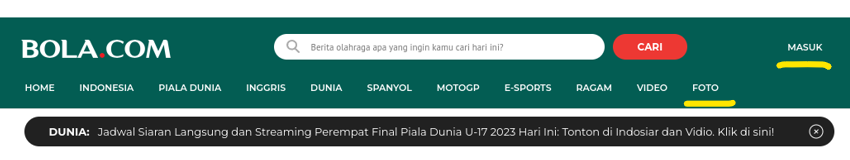

---

✅ Ниже приведен пример комплексной кнопки (кнопка `See All ->` является едиными элементом). Так как кнопка (`->`) имеет четкие границы и не пересекается никаким образом со своим соседом, то ее нужно разметить.

🚫 Ниже приведен пример комплексной кнопки (кнопка проигрывания видео), такая кнопка сущетсвует в контексте более крупного элемента (интерактивной является сразу вся область с превью видео), ее не нужно размечать. 
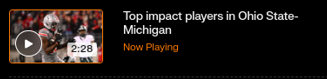

---

✅ Визуально разряженные табы размечать нужно.

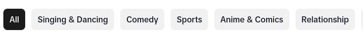

🚫 Табы без свободного места между элементами размечать не нужно.

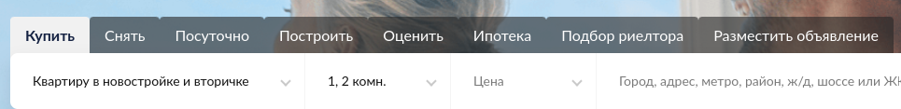

---

### Примеры некорректных и узких случаев разметки

Ниже приведены примеры некорректных кнопок и корректной разметки для некоторых узких случаев. 

🚫 Длинные триггеры для открытия аккордионов (например, в FAQ), размечать не нужно.
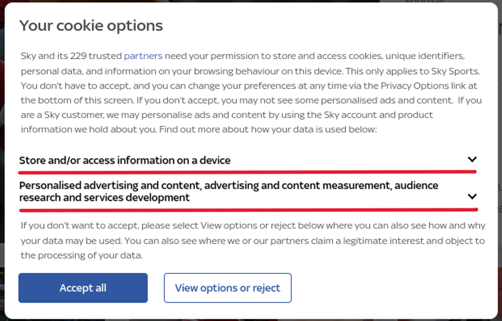

✅ Корректная разметка кнопок для примера выше.
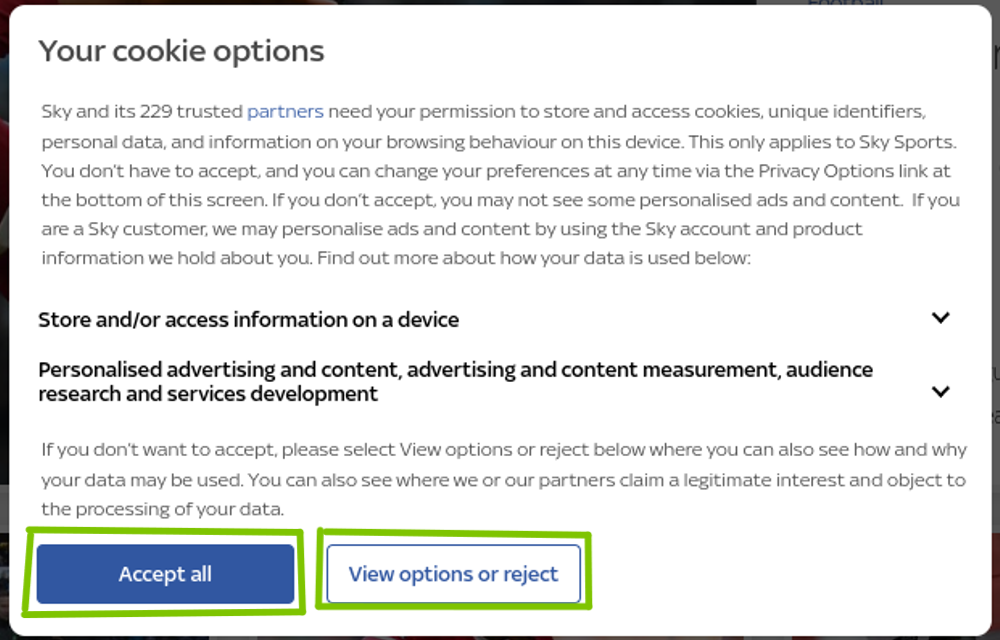

---

🚫 Кнопки без фона размечать не нужно.
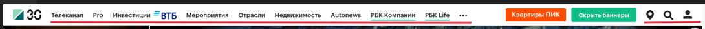

✅ Корректная разметка кнопок для примера выше. 
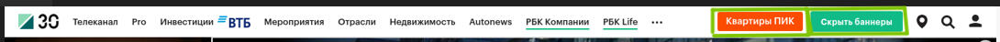

---

🚫 Тоггл-кнопки размечать не нужно.

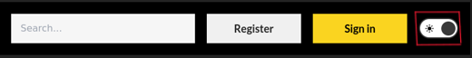

✅ Корректная разметка кнопок для примера выше.

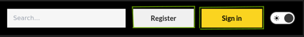

---

🚫 Ссылки размечать не нужно

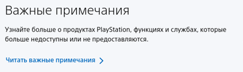

---

🚫 Группу кнопок, не имеющих явных границ между друг другом, размечать не нужно. 

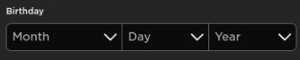

---

🚫 Брендовые кнопки, содержащие логотипы, размечать не нужно.

