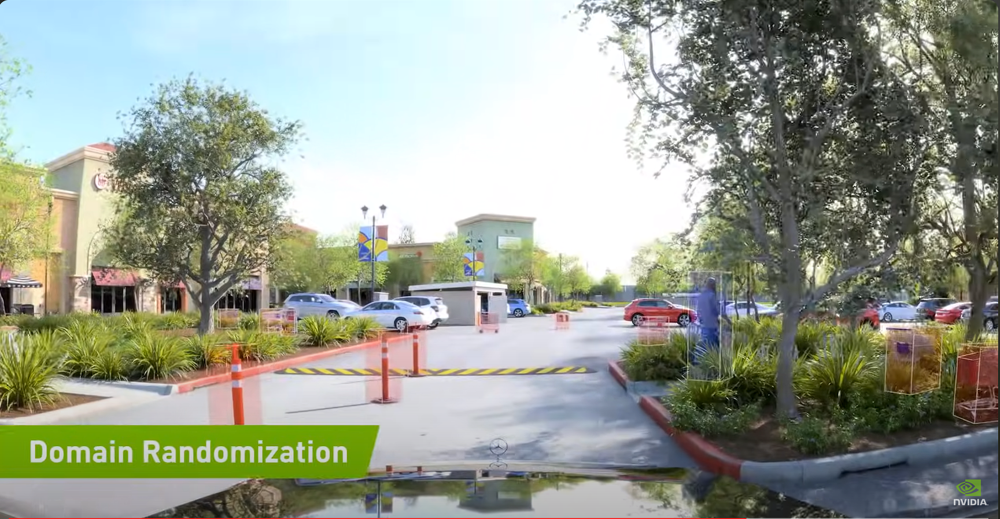

## Аналитическая записка по результатам поиска кейсов использования синтетических данных

Я занимаюсь генеративным интерфейсом и пока не представляю, каким образом я мог бы дополнить необходимые мне данные синтетическими. По-этому для данной задачи я выбрал следующую постановку проблему "использование синтетических данных для детекции объектов".

Идея по использованию 3d-моделей для создания ультра-реалистичных изображений или дополнения реальных изображений смоделированными деталями рассматривается в [статье](https://blogs.nvidia.com/blog/what-is-synthetic-data/) от компании NVIDIA о синтетических данных и об одном из продуктов компании - [NVIDIA Omniverse Replicator](https://developer.nvidia.com/omniverse/replicator), - позволяющем дополнить реальные видео смоделированными деталями.

Ниже приведен пример из видеоролика, демонстрирующий возможности по добавлению 3д объектов в видео для тренировки нейронной сети детектить препятствия при езде автомобиля. В данном случае разделительные столбики, машины, пешеходы на парковке сгенерированы с помощью этого инструмента.

В статье делается упор на то, что использование синтетических данных необходимо для качественной и тщательной разметки больших наборов данных для обучения нейронных сетей, в пример приводится исследование от компании Gartner, в котором утверждается, что к 2030 году данные, используемые для обучения моделей, будут синтетически сгенерированы с использованием различных техник (включая статистические модели, симуляции и проч).

Основные причины, которые выделяют авторы статьи, это:
- экономия затрат, снижение стоимости разметки изображения засчет автоматического лейблинга при создании и интеграции модели;
- решение проблем конфиденциальности;
- обеспечение разнообразия данных для отображения реального мира;
- намеренное включение редких случаев и узких кейсов.

Так же в пример можно привести датасет [synthetic-dataset-for-object-detection](https://www.kaggle.com/datasets/ekibee/synthetic-dataset-for-object-detection/data), содержащий гипер-реалистичные 3д модели, созданные с помощью Unity. Автор утверждает, что датасет был использован и помог решить проблему, связанную с детекцией объектов, но не уточняет детали. В датасет включены маски для детектируемых объекто в качестве лейблов. Целью создания такого датасета может быть обучение модели для детекции специфичных предметов в видео-потоке, например, оружия. 

Еще одним примером будет датасет [synthetic-dataset-for-home-interior](https://www.kaggle.com/datasets/luznoc/synthetic-dataset-for-home-interior), предоставляющий рендеры и растризованные изображения для моделирования домашнего интерьера. Датасет содержит самирендеры, растровые изображения, отображающие глубину, разную передачу цвета, семантическую разметку цветом. Возможным вариантом для использования такого датасета может быть обучение робота-пылесоса для корректного передвежения по квартире.

Из более узких кейсов можно привести датасет [synthetic-chess-board-images](https://www.kaggle.com/datasets/thefamousrat/synthetic-chess-board-images), содержащий сами рендеры и аннотацию расположения фигур и угол их поворота. Целью для использования такого датасета может быть детекция позиции фигур на доске. 